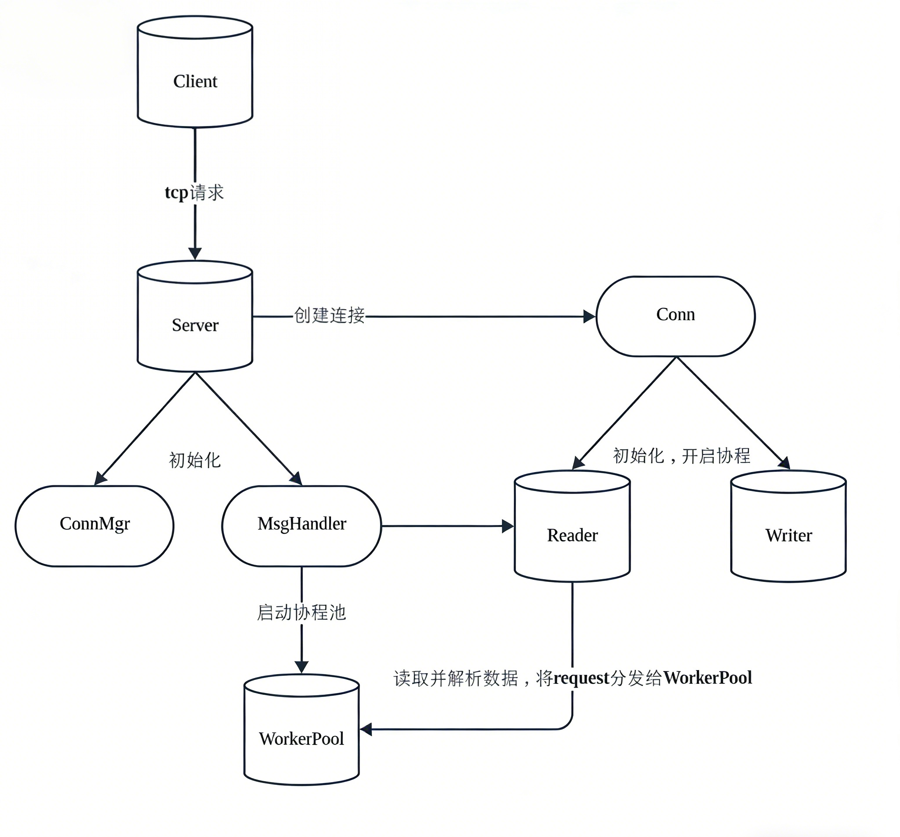

# Sinx

Sinx 是一个基于 Go 的轻量 TCP 长连接网络框架，整体设计参考了 Zinx 的分层思想，并在当前代码库中落地了以下核心能力：

- 高并发处理模型：采用协程池 + 任务队列的并发架构，读写协程解耦，实现 I/O 处理与业务逻辑的并行执行，支持 万级长连接并发处理。

- 高效二进制通信协议：基于 TLV（Type-Length-Value）格式 的自定义二进制协议，实现消息长度字段解析机制，有效解决 TCP 粘包与拆包问题，提升数据传输效率。

- 模块化架构设计： 提供完整的服务器核心组件，包括：服务器生命周期管理、连接管理器（Connection Manager）
和可扩展的协议解析与消息处理接口，便于开发者快速构建自定义网络服务。

- 长连接场景支持：内置 心跳检测机制 与 断线重连策略，保障长连接通信的稳定性，适用于实时通信、游戏服务器及物联网等场景。



## 设计理念

Sinx 的核心理念是“协议处理与业务逻辑解耦”：

- `siface` 只定义抽象接口，不绑定具体实现
- `snet` 负责网络连接、协议收发、并发调度与生命周期管理
- 业务只需要实现路由 `IRouter`，按 `msgId` 注册即可

这样可以让你在不改底层网络代码的前提下，持续扩展业务消息协议。

## 项目结构

```text
Sinx/
  siface/    # 抽象接口层（Server/Client/Conn/Router/Request）
  snet/      # 网络实现层（连接、服务端、客户端、消息处理器、拆包器）
  srouter/   # 内置路由示例（心跳路由）
  shook/     # Hook 组件示例（心跳发送与超时检查）
  sutils/    # 全局配置加载（GlobalObject）
  examples/  # 场景示例
```

## 核心流程

### 服务端

1. `snet.NewServer()` 读取配置并初始化 `MsgHandle` 与 `ConnManager`
2. 调用 `AddRouter(msgId, router)` 绑定业务处理器
3. `Start()` 开启监听，接受连接并创建 `Connection`
4. `Connection.StartReader()` 持续读包、解包，构造 `Request`
5. 请求进入 worker 池（或直接 goroutine）执行 `PreHandle -> Handle -> PostHandle`
6. `Connection.Stop()` 负责等待在途请求完成并关闭连接

### 消息协议

当前采用固定头部协议：

- 4 bytes: `DataLen`
- 4 bytes: `MsgID`
- N bytes: `Data`

实现位于 `snet/datapack.go` 与 `snet/message.go`。

## 配置说明

全局配置定义在 `sutils/globalobj.go`，默认从 `conf/Sinx.json` 读取。

主要字段：

- `Name`: 服务名
- `Host`: 监听地址
- `TcpPort`: 监听端口
- `MaxConn`: 最大连接数
- `MaxPacketSize`: 单包最大长度
- `WorkerPoolSize`: worker 数量
- `MaxWorkerTaskLen`: 每个 worker 的任务队列长度
- `MaxMsgChanLen`: 连接缓冲发送通道长度

注意：配置文件路径是相对工作目录的，运行示例时请进入对应示例目录再执行。

## 快速开始

环境要求：

- Go 1.25+

拉取并运行示例（Windows PowerShell）：

```powershell
cd .\examples\client\Server
go run .
```

新开终端运行客户端：

```powershell
cd .\examples\client\Client
go run .
```

## 示例列表

- `examples/client`: 基础客户端/服务端通讯
- `examples/multiple_routing`: 多消息 ID 路由分发
- `examples/unpack_repack`: 拆包与封包演示
- `examples/link_management`: 连接创建/销毁 Hook 与连接管理
- `examples/heartbeat`: 心跳请求/响应与超时处理
- `examples/concurrent_testing`: 并发压测场景（QPS 粗测）

## 业务扩展示例

```go
type PingRouter struct {
    snet.BaseRouter
}

func (p *PingRouter) Handle(req siface.IRequest) {
    _ = req.GetConn().SendMsg(1, []byte("pong"))
}

func main() {
    s := snet.NewServer()
    s.AddRouter(1, &PingRouter{})
    s.Serve()
}
```
# 代码开发中的问题与解决方案

## 问题 A：客户端启动与发送时序不一致导致空指针/竞态

### 现象

- 客户端调用 `Start()` 后立即发送消息，偶发 `Conn()` 未就绪。

### 原因

- 连接建立与业务发送缺少明确的“ready”同步点。
- 协程启动顺序不等于初始化完成顺序。

### 解决方案

- 为客户端增加“连接就绪”信号（ready channel / callback）。
- 对外暴露 `WaitReady(timeout)` 或在 `Start()` 内阻塞到连接可用。
- 在发送路径增加空连接保护与错误返回。

### 验证标准

- 压测下连续 1 万次启动+发送，不出现空指针。
- `-race` 下无相关竞态告警。

---

## 问题 B：请求未正确 `Done()` 导致 `Stop()` 卡死

### 现象

- 服务端调用 `Stop()` 时偶发阻塞，无法退出。

### 原因

- 当前请求生命周期依赖 `WaitGroup`。
- 当 `msgId` 无对应路由时，`DoMsgHandler` 直接 `return`，没有调用 `request.Done()`。
- `Connection.Stop()` 中 `wg.Wait()` 永远等不到归零。

### 解决方案

- 在 `DoMsgHandler` 开头 `defer request.Done()`，保证所有分支都归还计数。
- 对 `request.Done()` 增加幂等保护（可选），避免重复调用造成 panic。

### 验证标准

- 构造未知 `msgId` 请求，`Stop()` 能稳定退出。
- 压测下频繁启停不出现卡死。

---

## 问题 C：`SetOnConnStop` 赋值错误导致关闭回调失效

### 现象

- 注册 `OnConnStop` 后未触发，或触发了错误回调。

### 原因

- `Server.SetOnConnStop` 内部把函数赋给了 `onConnStart`。

### 解决方案

- 修正赋值：`s.onConnStop = hookFunc`。
- 补充单元测试：分别注册 start/stop hook，验证触发次数和顺序。

### 验证标准

- start/stop hook 均可独立触发且不串扰。

---

## 问题 D：连接关闭流程缺少“读停/写停/通道关闭”的分阶段策略

### 现象

- 高并发下连接关闭时可能出现 goroutine 残留、写协程空转。

### 原因

- `StartWriter` 读到关闭通道后仍在循环，缺乏统一退出信号。
- 关闭顺序不清晰（先等任务、再停读写、再清理资源）。

### 解决方案

- 统一关闭流程（建议）：
  1. 标记连接关闭（CAS）
  2. 停止接收新请求
  3. 等待在途请求完成（`wg.Wait`）
  4. 关闭写通道并退出 writer
  5. 关闭 socket
  6. 从 `ConnManager` 移除
- writer 协程在通道关闭时应 `return`，避免空转。

### 验证标准

- 压测后 goroutine 数量可回落到基线。
- 启停循环 100 次无泄漏增长。

---

## 问题 E：连接管理器并发改造后缺少边界保护

### 现象

- 极端场景下可能出现计数与真实连接数短时不一致，或重复移除导致计数异常。

### 原因

- `sync.Map + atomic` 简化了锁竞争，但需要严格处理“重复 Add/Remove”与状态机一致性。

### 解决方案

- `Add/Remove` 增加幂等判断。
- `ClearConns()` 后禁止新增连接并返回明确错误。
- 增加连接数一致性巡检（debug 模式）。

### 验证标准

- 并发 Add/Remove 压测下，计数不出现负数或异常跳变。

---

## 问题 F：可观测性不足，排障成本高

### 现象

- 日志字段不统一（`Sinx/Cinx` 混用），关键路径缺少结构化信息。

### 原因

- 日志缺少统一规范（组件名、连接 ID、msgId、错误码、耗时）。

### 解决方案

- 统一日志前缀与字段格式。
- 在关键链路补齐：连接创建/关闭、路由分发、worker 入队/出队、异常退出。

### 验证标准

- 任意一个连接问题可在 5 分钟内通过日志定位到阶段（接入/读包/路由/写回/关闭）。

---

## 经验总结

- 并发系统的核心不是“跑起来”，而是“可关闭、可恢复、可验证”。
- 生命周期设计优先于业务功能堆叠。
- 所有异步流程都必须有：进入条件、退出条件、异常兜底。
- 在高并发场景下，先保证一致性，再追求极致性能。
